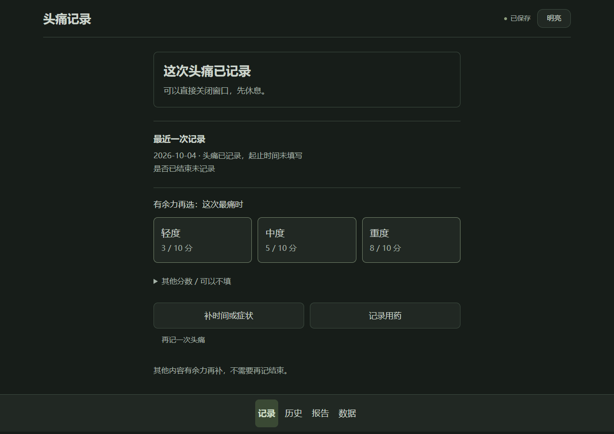
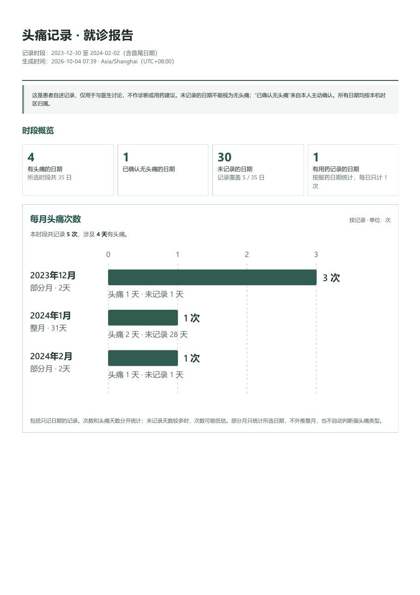

# 头痛记录 · Headache Diary

头痛的时候，填写一张完整的表单并不容易。这个项目把最开始的操作缩短为一次点击：打开桌面图标，点 **「记一次头痛」**，看到保存成功后就可以关窗休息。疼痛程度、症状、用药和起止时间都能以后再补；不记得的内容就留空。

记录积累下来以后，可以在日历里看哪天痛过、当天记了几次，也可以按月查看次数和头痛天数。就诊时，把选定时间段打印或保存成 PDF，让医生结合病史核对这些记录。

这是一个在自己电脑上运行的网页应用，界面里也使用「轻记」这个名字。目前提供 **Windows x64 安装包**，默认采用暗色界面，不需要注册账号，健康记录不上传云端。当前发布版本为 **1.3.0**，源代码采用 [MIT 许可证](LICENSE)。

**[下载安装包](https://github.com/canusayany/headache-diary/releases/latest)** · [详细使用说明](使用说明.md) · [报告统计口径](图表设计说明.md) · [反馈问题](https://github.com/canusayany/headache-diary/issues)

如果你只是想使用软件，先看下面的安装和记录方法就够了。源码运行、测试和安装包构建放在本文后半部分。

## 先把软件装好

1. 打开 [发布页](https://github.com/canusayany/headache-diary/releases/latest)，下载 `HeadacheDiary-Setup-1.3.0-x64.exe`。GitHub 自动提供的 Source code 压缩包是开发用的源代码，不是安装程序。
2. 运行安装包，按向导完成安装。程序按当前 Windows 用户安装，无需管理员权限，默认会创建桌面与开始菜单入口。
3. 以后从桌面的 **「头痛记录」** 图标打开。安装包已经包含运行环境，不用另外安装 Node.js、Python 或开发工具。

电脑需要已有 Microsoft Edge 或 Google Chrome。安装后的日常记录、回看和报告不需要互联网。

兼容目标为 Windows 10 / 11 x64，目前实际验证的是 **Windows 11 x64 + Microsoft Edge**。Windows 10、Chrome 和其他系统没有经过本次独立机器实测；手机的小窗口布局测试也不代表已经提供手机版安装包。

当前安装程序尚未进行发布者数字签名。发布页同时提供 `SHA256SUMS.txt`，可以核对下载文件是否一致。遇到系统拦截时，请先核对来源，不要为了运行软件而关闭安全功能。完整的安装、升级、卸载和校验方法见 [安装说明](安装说明.md)。

## 头痛的时候，只做这一件事

打开软件，点一次 **「记一次头痛」**。现在痛着、刚刚痛过，都用这个入口。

看到 **「这次头痛已记录」** 和 **「已保存」** 后，这一笔就已经保存到本机，可以直接关窗休息。不需要再回来点一次结束，也不要求当场填写评分或症状。默认暗色是为了尽量减少屏幕刺激；觉得仍然太亮时，也可以降低电脑本身的屏幕亮度。



上图是安装测试新建日记后保存一条合成记录的界面。下面的程度选择和补充按钮都是可选项，保存成功并不依赖它们。

这一笔的含义是 **“这一天发生过头痛”**。软件会保留登记时间来管理记录，但不会把它当成头痛开始的时间，也不会因为你关窗就认为头痛已经结束。具体起止、结束状态、程度和症状先保留为未记录。

同一次头痛只记一笔。如果后来又有一次需要单独记录的头痛，重新打开窗口即可直接登记；窗口一直开着时，用「再记一次头痛」新增一条。

没有看到保存成功，就不要把它当作已经存进日记。出现「未保存」或连接失败时，先保留窗口，按提示恢复连接或重试。保存中的按钮会暂时禁用，重试也会沿用同一条记录，避免把一次失败操作重复追加。

## 缓解以后，再补自己记得的内容

首页的「最近一次记录」里可以点 **「补时间或症状」**。更早的记录在「历史」中点开。能想起来多少就补多少，不必为了填完整而猜一个时间或分数。

可以补充实际开始时间、是否已经结束、结束时间、0–10 分疼痛程度，以及部位、感觉、伴随症状、活动影响、本人怀疑的诱因、经期状态和备注。只记得日期时，就继续保留仅日期记录；只补了症状，也不会自动推断已经结束。

需要记录实际服药时，点 **「记录用药」**。药名和服药时间需要填写，剂量和效果可以之后再补。在「数据」里保存常用药，只是为了下次少输入一些内容，不会自动产生服药记录，也不提供药物或剂量建议。

漏记了过去某一天，可以进入 **「历史 → 点那个日期 → 补记这一天」**。历史顶部的「补记一次」会直接新增当天记录；补过去的日期时，使用日历中的具体日期更明确。

不痛的一天也值得留下来。首页可以点「今天没有头痛」，历史日期里可以「确认这天无头痛」。已有头痛记录的日期不能同时确认为无头痛；后来补记头痛时，软件会移除相冲突的无头痛标记。

如果误记了，在首页点「补时间或症状」，或在历史里打开那条记录，再用 **「删除记录 → 确认删除」**。删除会同时移除该条记录下的用药明细，操作前的版本仍保留在本机旧版本中。

## 怎样看懂日历和月度统计

进入「报告」后，先选择日期范围。可以看近 28 / 56 / 90 天，近 6 个自然月，或者自己指定起止日期。近 6 个月是今天所在月份截至今天，加上之前 5 个自然月，不是固定取 180 天。

日历回答的是：**哪一天有头痛，这一天归属了几次记录？** 次数按头痛开始日期或仅知道的日期计入，不按填写日记的登记时间计入。点日期可以直接查看当天的记录，包括从之前日期延续过来的头痛。

| 日历里的标记 | 它表示什么 |
| --- | --- |
| `3 次` | 开始日期或已知头痛日期归属于当天的记录有 3 条 |
| `延续` | 有记录从更早的日期延续到这一天，当天没有新增这条记录的次数 |
| `无` | 你明确确认这一天没有头痛 |
| `?` | 这一天没有记录，头痛情况未知 |

**记录次数和头痛天数是两件不同的事。** 比如，你后来补清楚一条头痛在 12 月 31 日 23:00 开始，1 月 1 日 02:00 结束，那么 12 月新增记录计 1 次，1 月这条记录计为延续；两个日期都算有头痛日。同一天记录了两条，次数是 2，但头痛日仍然只有 1 天。

这里的“次数”是有效记录条数。软件不会根据时间间隔自动判断两条是否属于同一次医学意义上的发作；重复登记会影响次数，需要自己核对。仅知道日期的记录只确认那一个日期，不会把未知时长扩展为之后每天都在头痛。

月度柱状图把每个月的记录次数放在一起，同时标出头痛天数和未记录天数。全月既没有头痛记录，也没有主动确认无头痛时，显示「未记录」，不能解释为这个月没有头痛。选择范围只覆盖某个月一部分时，会写明「部分月」及覆盖日期，不把这几天推算成整个自然月。

日历范围超过 12 个月时可以翻到下一组。分页只是为了让界面容易浏览，月度统计和导出仍包含全部所选日期。日期按电脑本机时区归属，报告也会标明时区，请保持电脑时间和时区正确。

<details>
<summary>看一份报告的实际效果：月度图和每日日历</summary>

下面两页来自自动化测试的合成病例：12 月有 3 条新记录，1 月、2 月各有 1 条，其中一条跨年延续。日期、分数和次数均是测试输入。




</details>

## 去看医生之前

在「报告」里选好需要讨论的时间段，点 **「预览就诊报告」**，先检查日期和记录。然后可以打印，或在浏览器打印窗口里选择「另存为 PDF」，也可以下载独立 HTML 报告。

报告会把图表和明细放在一起：每日与每月统计、头痛记录、用药日期与剂量明细，以及已经填写的程度、症状、时间、备注等。姓名或称呼是选填的，不填写也能生成报告。

平均评分只使用已经填写的分数，持续时间中位数只使用起止明确的完整记录，并注明样本数。没有填写的内容不会作为 0 分或 0 分钟参与计算，未知结束状态也会明确写出。这些说明能帮助医生判断哪些数字有依据，哪些地方仍缺少信息。

几种导出的用途不同：

| 格式 | 更适合做什么 | 能否恢复整本日记 |
| --- | --- | --- |
| PDF | 打印、带去就诊、发给需要查看报告的人；由浏览器打印保存 | 不能 |
| HTML | 离线查看完整报告，也可再次打印 | 不能 |
| CSV | 在表格软件里整理记录和用药明细 | 不能 |
| JSON | 保留完整日记，换电脑或恢复记录 | 可以 |

独立 HTML 内置图表和样式，不依赖网络，也没有脚本。打印版用白底，便于医生阅读；应用本身仍默认暗色。报告和备份都可能包含健康信息，分享之前请先确认里面有哪些内容。

这个软件用来保存自述、帮助沟通，不自动诊断偏头痛类型，也不提供治疗或处方建议。报告里的关联和本人怀疑的诱因，需要由医生结合病史评估。

## 记录放在哪里，怎么备份

安装版把记录保存在当前 Windows 用户的：

```text
%LOCALAPPDATA%\HeadacheDiary\data
```

把这行路径粘贴到资源管理器地址栏即可找到。`state.json` 是当前日记，`backups` 保存修改前的最近 30 份旧版本。升级保留数据，卸载也保留这个数据目录；重新安装后会继续读取已有日记。

不过，本机旧版本和主记录还在同一台电脑上，不能保护你免受硬盘损坏或整台电脑丢失的影响。建议定期在 **「数据 → 下载备份」** 导出完整 JSON，另外保存到自己信任的位置。

换电脑或迁移日记时，先从原软件导出 JSON，再在目标软件的「数据」里选择备份文件，核对记录数量，确认恢复。**恢复会替换当前整本日记，不会把两份日记合并。** 恢复前请先下载当前日记的备份；软件也会在替换前保留当前版本。

源码版默认保存在项目里的 `data/`，与安装版的数据目录不同。安装程序不会自动导入源码目录中的日记，迁移时同样使用完整 JSON。

公开这个项目，只是在公开程序源代码，个人记录仍保存在自己的电脑上。仓库没有收录实际患者的日记、备份或报告，本文截图也全部使用合成记录。

### 本机保存的边界

软件没有云同步、账户登录或会话认证，也没有对记录文件进行静态加密。它只监听本机地址，并限制网页请求来源；服务开启时，同一电脑其他已登录账户或本地程序仍可能访问记录。请在自己信任的电脑和账户上使用，并妥善保管主动导出的文件。

关闭应用窗口不会自动关闭后台服务。浏览器自身的「安装此站点为应用」也不会代替本机服务，因此日常优先从桌面「头痛记录」图标打开。如果服务停止了，缓存页面可能还能显示，但读取和保存日记需要重新启动服务。

## 常见问题

### 已经痛完了，还能记吗？

可以。点同一个「记一次头痛」入口就会留下当天记录，软件不会猜测当时的开始时间、结束时间或现在是否已经结束。能回忆起的实际情况，可以之后补；不是当天的记录，用历史日历补记。

### 为什么没有要求我分别点“开始”和“结束”？

一次头痛期间再次打开软件，对正在疼痛的人可能就是额外负担。首页只要求登记一次，实际起止和是否结束由你有余力时选填。没有时间信息的记录仍可用于查看当天是否痛过和记录次数，只是不参加已知完整时长的统计。

### 没有记录的一天，会不会当作没头痛？

不会。它会保留为未知，在日历里显示 `?`。只有你主动确认没有头痛，才会标为「无」。连续漏记几天时，月度报告也会显示这几天没有记录。

### 我想先看看效果，会动到自己的记录吗？

进入 **「数据 → 体验示例 → 看看示例」**。示例操作只在当前页面内存里生效，不写入真实日记；退出示例后重新读取自己的记录。空历史页也有「看看示例」入口。示例报告可以导出，恢复真实 JSON 在示例模式里不能执行。

### 点了按钮但一直没有成功提示怎么办？

以界面的保存结果为准。保留窗口并按提示重试，不要把尚未确认的一笔当作已经保存。连接失败时，可以先从桌面图标重开服务；不要通过删除数据文件夹来修复打不开的问题。

### 能在手机上用，或者和另一台电脑同步吗？

目前提供的是 Windows 本机使用方式，没有多设备同步、手机安装包或手机连接电脑的服务。小窗口布局经过测试，是为了适应较窄的桌面窗口，不表示已经支持手机部署。

### PDF 能不能拿来恢复？

不能。PDF、HTML 和 CSV 是查看材料，恢复完整记录需要 JSON。如果准备换电脑，请先在「数据」里下载完整备份，不要只带走就诊报告。

### 我反馈问题时应该提供什么？

在 [Issues](https://github.com/canusayany/headache-diary/issues) 写清操作系统、浏览器、软件版本、做了什么、看到什么，以及预期结果。尽量用「看看示例」或合成记录复现，不要直接上传个人日记或含健康信息的截图。日志里也可能有本机路径，分享前先检查。

## 从源码运行

以下内容面向想本地开发、检查实现或自行构建的人。只使用安装包时，不需要执行这些命令。

项目使用普通 HTML、CSS 和 JavaScript 构建界面，Node.js 提供本机服务，不需要数据库、云账号或外部图表服务。准备 Node.js 24.x 与 npm，本版本验证使用的是 Node.js 24.19.0。

```powershell
git clone https://github.com/canusayany/headache-diary.git
cd headache-diary
npm ci
npm start
```

浏览器打开 <http://127.0.0.1:17843/>。首次打开显示空日记，第一次成功保存时才在数据目录写入记录。停止这个终端启动的服务可以按 `Ctrl+C`。

开发时建议使用独立数据目录及端口，尤其不要用日常病历做调试：

```powershell
$env:HEADACHE_DATA_DIR = Join-Path $env:TEMP 'headache-diary-dev'
$env:HEADACHE_PORT = '17845'
npm start
```

这次运行使用 <http://127.0.0.1:17845/>。这些环境变量影响当前终端中的服务，Windows 桌面启动器仍按自己的配置启动；不要把它当作更改桌面日记位置的方法。安装版使用 `127.0.0.1:17844`，与源码版分开。

Windows 源码版也可以创建桌面快捷方式：

```powershell
powershell -NoProfile -ExecutionPolicy Bypass -File .\install-desktop.ps1
```

快捷方式依赖项目的原位置和已安装的 Node.js，因此请保留项目目录。脚本会创建名为「头痛记录」的桌面快捷方式，已有同名快捷方式会被替换。日常用户优先使用安装包，可以少处理这些路径和运行环境。

### 代码放在哪儿

前端和医生报告共用数据模型与图表渲染，避免同一条记录在页面和导出里产生不同含义。本机服务负责校验、保存和旧版本保留，使用修订号处理并发修改；它不承担账号服务或云同步。

| 文件或目录 | 主要职责 |
| --- | --- |
| `app.js`、`styles.css` | 页面、选填表单、保存状态与患者操作 |
| `model.js` | 数据校验、日期归属、头痛与用药统计 |
| `charts.js` | 应用和医生报告共用的日历、月度 SVG 图表 |
| `reports.js` | 独立 HTML 报告、CSV 和 JSON 导出 |
| `server.js` | 本机 HTTP 服务、串行写入、自动旧版本和实例身份 |
| `sw.js` | 缓存界面资源；不缓存病历 API |
| `launch.ps1`、`launch.vbs` | Windows 桌面启动和正确实例复用 |
| `installer/`、`scripts/` | 安装、卸载、图标及载荷构建 |
| `tests/` | 单元、集成、浏览器和实物安装验收 |

`data/`、`output/`、`test-results/`、`build-tools/`、`dist/` 及本地凭证均由 Git 忽略。患者数据不应加入源码或测试夹具。

## 测试做了什么

在已经安装 Microsoft Edge 的 Windows 环境运行：

```powershell
npm ci
npm test
npm run test:e2e
```

端到端测试会启动独立服务，使用随机本机端口和合成病例，不需要预先启动日常记录服务，也不写入真实病历。输出保存在被 Git 忽略的 `test-results/`。配置覆盖 1280px 桌面与 390px 暗色小窗口，并检查 320px 布局；部分 Windows 启动和文件占用测试在其他系统上会跳过。

1.3.0 在 Windows 11 + Edge 的本机验收结果如下：

| 验收范围 | 结果 | 验证内容 |
| --- | --- | --- |
| 单元与本机集成 | 121 项通过 | 日期、未知状态、并发保存、写盘故障、服务恢复、启动和打包 |
| 真实浏览器端到端 | 81 项通过，1 项跳过 | 单次点击、选填、错误恢复、暗色小窗、图表、下载和 A4 打印 |
| MIT 许可打包专项 | 7 项重新执行并通过 | 主许可证、第三方声明及载荷白名单 |
| 最终 EXE 安装生命周期 | 6 个里程碑通过 | 安装、启动、一键记录与导出、升级、卸载、重装的数据保留 |

唯一跳过项是小窗口重复的长备注 A4 打印测试；对应桌面用例已执行，新增图表打印在两个视口都执行。浏览器测试配置没有自动失败重试。

统计测试覆盖同日多条、跨日跨月、闰日、仅日期记录和未记录日期。26 个月、763 天的范围测试检查分页之后导出仍完整；实际 PDF 经过文字核对和页面渲染检查，长备注也核对了完整性。

单次保存另在两个视口各测 30 次，计时从真实浏览器点击事件到保存确认，并逐次核对磁盘。P95 分别为桌面 26.90 ms、小窗 26.70 ms。这个数字不包含从桌面打开窗口、浏览器启动或人的阅读时间，只表示本机这次测量。

更完整的口径、环境和限制见 [测试验收报告](测试验收报告.md)。这些结果说明软件行为经过验证，**不等同于已经完成真实患者试用**，也不是对所有电脑速度与兼容性的保证。

## 自行构建 Windows 安装包

构建工具不随源码仓库提供。需要自行准备官方 Windows x64 Node.js 运行时，以及完整的 [Inno Setup](https://jrsoftware.org/isinfo.php) 安装目录。

本版本使用 Node.js v24.19.0 和 Inno Setup 6.7.3。Node 目录必须同时包含 `node.exe` 与未修改的完整 `LICENSE`；Inno 目录需有 `ISCC.exe` 及其相邻依赖，不能只复制一个编译器文件。中文语言文件已放在 `installer/ChineseSimplified.isl`，使用构建工具时仍需遵守其自己的许可。

默认工具目录是 `build-tools/node-runtime/` 和 `build-tools/inno-setup/`，准备好后运行：

```powershell
npm run build:installer
```

使用其他工具位置时，明确指定路径：

```powershell
powershell -NoProfile -ExecutionPolicy Bypass -File .\scripts\build-installer.ps1 -CompilerPath 'C:\tools\inno-setup\ISCC.exe' -RuntimeDirectory 'C:\tools\node-v24.19.0-win-x64'
```

输出为 `dist/HeadacheDiary-Setup-1.3.0-x64.exe` 和 `dist/SHA256SUMS.txt`。构建只按白名单收集程序文件，不读取患者 `data/`；主项目许可证、中文翻译许可声明及 Node 的完整许可都会随包保留。

只需要检查载荷内容时，可以先执行：

```powershell
npm run build:stage -- --runtime-dir 'C:\tools\node-v24.19.0-win-x64'
```

### 安装包需要单独验收

源码测试通过，不代表安装后的启动、升级和卸载也一定正常。刚构建的 EXE 还可以这样验收：

```powershell
npm run test:installer
```

这项测试需要 Windows、Edge 和专用测试账户。它会实际写入当前用户的安装登记，并安装、升级、卸载和重装测试副本；发现已有软件安装登记时会拒绝运行，不应为了通过测试删掉日常安装的登记。

测试使用隔离安装目录、独立数据目录与合成病例，核对最终载荷哈希、内置运行环境、桌面启动链、保存和导出，以及记录与备份是否保留。证据写入 `output/installer-tests/`。当前验收明确检查 Node.js v24.19.0，改变运行时版本时应同步更新测试和第三方声明。

## 贡献、参考与许可证

欢迎提交可复现的问题或改进。患者正在痛的时候需要做什么、保存是否可信、未知信息是否被保留下来，是评估改动时最先要看的几件事。贡献前请阅读 [CONTRIBUTING.md](CONTRIBUTING.md)，反馈和测试中使用合成病例。

记录字段参考 [NICE 的头痛日记建议](https://www.nice.org.uk/guidance/cg150/chapter/Recommendations)。图表设计参考了 Apple 健康的回看层次、CDC 的数据标签与缺失标注，以及 FDA 公开资料中的月度头痛日展示。采用了哪些做法、统计与临床指标有何区别，写在 [图表设计说明](图表设计说明.md) 中。引用这些资料不表示本软件获得机构认证、批准或认可。

应用原创源代码采用 [MIT 许可证](LICENSE)，可以按其条款使用、修改和分发。第三方组件保留各自的版权和许可证，详见 [THIRD-PARTY-NOTICES.txt](THIRD-PARTY-NOTICES.txt)、[中文安装翻译许可](installer/ChineseSimplified.LICENSE.txt) 和安装包中的 `runtime/LICENSE.txt`。
